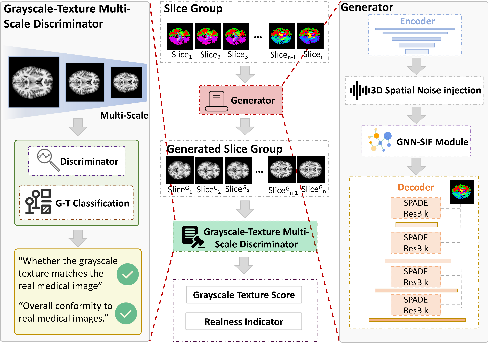

# 🧠 AnatoMaskGAN
**GNN-Driven Slice Feature Fusion and Noise Augmentation for Medical Semantic Image Synthesis**

[📂 Repository](https://github.com/noheadwuzonglin/AnatoMaskGAN/tree/main) · [📄 Paper (arXiv:2508.11375)](https://arxiv.org/abs/2508.11375)

---

## 📑 Table of Contents
- [1. Introduction](#1-introduction)
- [2. Features](#2-features)
- [3. Installation & Environment](#3-installation--environment)
  - [3.1 Requirements](#31-requirements)
  - [3.2 Clone the Repository](#32-clone-the-repository)
  - [3.3 Install dependencies](#33-Install-dependencies)
- [4. Usage](#4-usage)
  - [4.1 Training](#41-training)
  - [4.2 Testing / Generation](#42-testing--generation)
  - [4.3 Inference (Deployment)](#43-inference-deployment)
- [5. Model Architecture](#5-model-architecture)
- [6. Experimental Results & Metrics](#6-experimental-results--metrics)
- [7. FAQ](#7-faq)
- [8. Contribution Guide](#8-contribution-guide)
- [9. Acknowledgments](#9-acknowledgments)
- [10. License](#10-license)
- [11. References](#11-references)

---

## 1. Introduction
**AnatoMaskGAN** implements the ideas presented in the paper  
*“AnatoMaskGAN: GNN-Driven Slice Feature Fusion and Noise Augmentation for Medical Semantic Image Synthesis”* [(arXiv:2508.11375)](https://arxiv.org/abs/2508.11375).

This project focuses on medical semantic image synthesis using Generative Adversarial Networks (GANs).  
It introduces novel strategies to improve anatomical realism and inter-slice consistency.

**Key Contributions:**
- 💠 **GNN-Based Slice Feature Fusion:** Captures inter-slice anatomical relationships using Graph Neural Networks (GNNs).
- 🌀 **3D Spatial Noise Injection:** Enhances structure diversity by injecting spatial noise during generation.
- 🧩 **Grayscale–Texture Classifier:** Refines intensity distribution and texture fidelity.
- 🧠 **Cross-Dataset Generalization:** Demonstrated on L2R-OASIS and L2R-Abdomen CT datasets with significant performance gains over SOTA.

---

## 2. Features
- Supports both *Mask → Image* and *Image → Mask* generation tasks.  
- Incorporates **multi-slice GNN fusion** and **3D noise augmentation**.  
- Optional **texture classifier** for perceptual quality improvement.  
- Unified training, testing, and inference pipelines.  
- YAML-based configuration for flexible experiment setup.  
- Open-source under the **MIT License**.

---

## 3. Installation & Environment

### 3.1 Requirements
```bash
Python >= 3.8
PyTorch >= 1.12
CUDA >= 10.2  (recommended)

```

### 3.2 Clone the Repository
```bash
git clone https://github.com/noheadwuzonglin/AnatoMaskGAN.git
cd AnatoMaskGAN

```

### 3.3 Install dependencies
```bash
pip install -r requirements.txt
# or manually install
pip install numpy scipy matplotlib tqdm scikit-image networkx

```

## 4. Usage

### 4.1 Training
```bash
python train.py --opt options/train.yml
```
Common arguments:
| Argument               | Description                        |
| ---------------------- | ---------------------------------- |
| `--dataset`            | Dataset name (e.g., L2R-OASIS)     |
| `--use_noise3d`        | Enable 3D noise injection          |
| `--use_gnn_fusion`     | Enable slice fusion via GNN        |
| `--texture_classifier` | Enable texture classifier          |
| `--save_dir`           | Directory for checkpoints and logs |


### 4.2 Testing / Generation
```bash
python test.py --opt options/test.yml --model_path checkpoints/latest_net_G.pth
```
-Results (images, masks, metrics) will be saved under the results/ directory.


### 4.3 Inference (Deployment)
```bash
python create.py --opt options/create.yml --input_path my_masks/ --output_path my_images/
```
-Generates new medical images from given semantic masks.

## 5. Model Architecture🧠
## 5. Model Architecture 🧠

The overall architecture of AnatoMaskGAN is presented in **Figure 1** below. The framework is built around an innovative **Generator** (G) and an augmented **Grayscale-Texture Discriminator** (D), working together to ensure high-fidelity image synthesis and inter-slice consistency.



### Core Modules

* **Generator (G):** The main synthesis network. It takes the semantic mask as input and synthesizes the target medical image by integrating features fused from neighboring slices.
* **GNN-Fusion Module (GNN-SIF):** The **G**raph **N**eural **N**etwork-driven **S**lice **I**nter-slice **F**usion module. This component models and aggregates the spatial contextual dependencies between adjacent slices, ensuring anatomical structure consistency across the 3D volume.
* **3D Noise Injection:** An innovative 3D spatial noise injection strategy that introduces spatial perturbations to enhance the structural and textural diversity of the synthesized images.
* **Discriminator (D):** Responsible for distinguishing between real and generated images.
* **Grayscale–Texture Classifier:** Embedded within the Discriminator, it specifically optimizes the grayscale distribution and texture details, significantly improving the perceptual realism of the generated images.

### Loss Functions

The model is optimized using a combination of loss functions to ensure synthesis quality and structural fidelity, including: **Adversarial Loss**, **Reconstruction Loss (L1/L2)**, **Texture Loss**, and **Perceptual Structure Loss (e.g., LPIPS)**.

---

## 6. Experimental Results & Metrics
As reported in the paper:
| Dataset       | PSNR ↑       | SSIM ↑     | Improvement |
| ------------- | ------------ | ---------- | ----------- |
| L2R-OASIS     | **26.50 dB** | 0.857      | +0.43 dB    |
| L2R-AbdomenCT | 25.47 dB     | **0.8602** | +0.48 %     |

Ablation studies confirm that removing any module (GNN, Noise, Classifier) degrades performance across all metrics.

---

## 7. FAQ
- Q1. Can it be applied to MRI or other modalities?
  
Yes, as long as the dataset has slice-wise correspondence and semantic masks.
- Q2. Generated images look blurry.

Check if --use_gnn_fusion is enabled or reduce noise intensity.

Training longer or tuning the learning rate may also help.
- Q3. Small dataset?
  
Apply data augmentation (flips, rotations, slice sampling) to improve generalization.
- Q4. Training is slow.
  
Try lowering batch_size, reducing GNN depth, or using a GPU with more memory.

---

## 8. Contribution Guide
We welcome pull requests and issue reports!

1.Fork this repository

2.Create a new branch: feature/your-feature

3.Commit your changes with clear messages

4.Open a Pull Request

Please ensure code clarity and add comments when necessary.

---

## 9. Acknowledgments
Thanks to Zonglin Wu et al. for proposing
AnatoMaskGAN: GNN-Driven Slice Feature Fusion and Noise Augmentation for Medical Semantic Image Synthesis
[📄(arXiv:2508.11375)](https://arxiv.org/abs/2508.11375).
- We also acknowledge the open-source community for contributions in GNN, GAN, and medical image synthesis research.

---

## 10. License
This project is licensed under the MIT License.
See the [`LICENSE`](../LICENSE.md) file for details.


---

## 11. References
- Wu, Z., Xue, Y., Hu, Q., et al. (2025).
  
AnatoMaskGAN: GNN-Driven Slice Feature Fusion and Noise Augmentation for Medical Semantic Image Synthesis.

[📄(arXiv:2508.11375)](https://arxiv.org/abs/2508.11375)

- Additional related works can be listed here.
